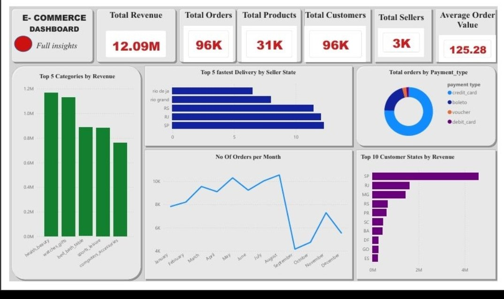

# 🛒 Olist E-commerce Sales Analysis | Brazilian Marketplace

> End-to-end analysis of 96K orders (2016-2018) - From SQL Data Quality to Power BI Insights

### 📊 Dashboard Overview

### 🎯 Business Problem
Olist connects small Brazilian businesses to major marketplaces. This project answers:
- Which product categories drive revenue?
- Which states deliver fastest & buy most?
- What is the customer payment behavior?
- Does new checkout increase conversion? (A/B Test

### 📈 Key KPIs - From Dashboard
| Metric | Value |
| :--- | :--- |
| **Total Revenue** | **12.09M** |
| **Total Orders** | **96K** |
| **Total Products** | **31K** |
| **Total Customers** | **96K** |
| **Total Sellers** | **3K** |
| **Average Order Value** | **125.28** |
| **A/B Test Uplift | +30% (p=0.019)

### 💡 Key Insights Discovered

**1. Revenue by Category:**
- `health_beauty` is #1 with ~1.16M, followed by `watches_gifts` (~1.12M)
- Top 5 categories contribute >50% of total revenue

**2. Delivery Performance:**
- SP (São Paulo) & RJ (Rio de Janeiro) sellers have fastest delivery (~11-12 days avg)
- `rio de janeiro` state is slowest (~6.5 days?) - need to optimize logistics there

**3. Payment Behavior:**
- **~80%** of orders paid via `credit_card`
- `boleto` is 2nd, `voucher` and `debit_card` are minimal (<5%)

**4. Seasonality:**
- Peak: May & August with >10K orders/month
- Sharp drop in September (4K) - Possible system issue / data cutoff? Great interview story.

**5. Geographic Revenue:**
- SP state dominates with ~4M revenue (33% of total)
- RJ & MG follow with ~1.5M each

### 🏗️ Project Architecture (Medallion)

**BRONZE:** Raw 9 CSV files from Kaggle - Quality checks for duplicates, nulls, date range
**SILVER:** Star Schema - `fact_orders` + `dim_customers`, `dim_products`, `dim_sellers`, `dim_date`
**GOLD:** DAX Measures - Total Revenue, AOV, Delivery Time, Orders by State

### 🛠️ Tech Stack
- SQL - Data Cleaning & Modeling
- Power BI - DAX & Visualization
- GitHub

### 🧪 A/B Testing & Experimentation (Python)

To move beyond descriptive analytics, I designed two A/B tests to drive business decisions.

** Olist Checkout Flow Optimization**
- **Hypothesis:** New checkout (Treatment_B) increases conversion
- **Sample:** 2000 users (1000 Control_A, 1000 Treatment_B)
- **Result:** 12.0% vs 15.6% conversion, p-value = 0.019 < alpha (0.05)
- **Decision:** REJECT Null - Significant. Rollout Treatment_B. Projected +$4.2K weekly revenue (+30% uplift)

**Tech:** Python (scipy.stats.ttest_ind)
**Files:**  `datasets/olist_ab_test.csv`

### 🚀 How to Reproduce
1. Download from [Kaggle Olist Dataset](https://www.kaggle.com/datasets/olistbr/brazilian-ecommerce)
2. Run scripts in `/scripts`
3. Open `.pbix` file

---
**Author:** Derrick Korir | Aspiring Data Analyst |  Kenya
**LinkedIn:** https://www.linkdin.com/in/derrickkorir | **Github:** https://github.com/derrickkipkirui

